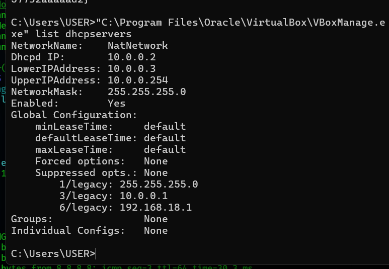
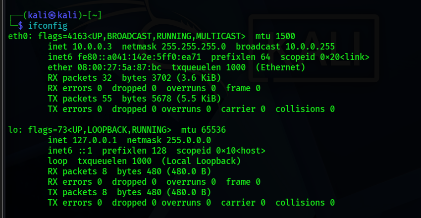

<div align="center">

#  Cybersecurity Lab Environment Setup

**Building an isolated virtual lab for penetration testing and ethical hacking practice**
</div>

<p align="center">
  
  
  
  
  
  
  
</p>

---

##  Project Overview

This project is about setting up my own **virtual cybersecurity lab** using VirtualBox and Kali Linux.

The goal was to build a safe, isolated environment on my own computer where I can practice things like network scanning, reconnaissance, and other security testing — without touching any real network or any system I don't own.

The lab runs on its own private virtual network, so I can add more virtual machines later and use them as "target" machines for practice.

---

##  Objectives week1 :

- Install VirtualBox on my Windows host machine.
- Install Kali Linux as a virtual machine.
- Create a private **NAT Network** for the lab (not just plain NAT).
- Connect the Kali VM to that network.
- Give the Kali VM a consistent, working IP address.
- Confirm the VM can reach the gateway and the internet, and that DNS works.
- Understand and fix a real IP conflict I ran into during setup.
- Take a clean snapshot once everything works, so I always have a safe point to go back to.
- Write all of this down so I (or anyone else) can repeat it later.

---

##  Purpose of the Lab

This lab gives me a safe, offline-from-production environment to practice things like:

- Network reconnaissance
- Port scanning
- Vulnerability assessment
- Packet analysis
- Web security testing
- Exploitation practice
- Trying out new security tools without risk

 **Important:** This lab is only for machines I own or have explicit permission to test. I will never point any of these tools at systems that aren't mine.

---

##  Lab Architecture


More target VMs can be added to this same NAT Network in the future for practice.

---


##  Lab Configuration

| 🧩 Component       | ⚙️ Configuration        |
| ------------------ | ------------------------ |
| 🖥️ Host OS         | Windows                 |
| 🧰 Hypervisor      | VirtualBox 7.2           |
| 🐉 Security OS     | Kali Linux 2026.2        |
| 🧠 Kali RAM        | 2048 MB                  |
| 🌐 Virtual Network | NAT Network              |
| 📡 Network Address | 10.0.0.0/24              |
| 🚪 Default Gateway | 10.0.0.1                 |
| 🖧 DHCP Server IP  | 10.0.0.2 (reserved by VirtualBox — cannot be assigned to a VM) |
| 🐧 Kali IP Address | 10.0.0.50 (static)       |
| 🌍 DNS Server      | 8.8.8.8, 1.1.1.1          |
| 🔮 DHCP Pool Range | 10.0.0.3 – 10.0.0.254    |

---

#  Lab Setup Procedure

## Step 1. Install VirtualBox

Downloaded and installed VirtualBox on my Windows host machine as the hypervisor that runs all the virtual machines.

**Tool:** VirtualBox 7.2


---

## Step 2. Create the NAT Network

Instead of using VirtualBox's basic "NAT" mode, I created a dedicated **NAT Network**. This matters because a plain NAT adapter is isolated per VM — the VM can reach the internet, but it can't talk to other VMs. A NAT Network is shared, so multiple VMs attached to it can talk to each other *and* reach the internet, which is exactly what a lab needs once more target machines get added.

Steps I followed:

1. Opened VirtualBox → **File → Tools → Network Manager**.
2. Went to the **NAT Networks** tab and clicked **Create**.
3. Renamed it to `NatNetwork` and set:

```text
Network Name: NatNetwork
IPv4 Prefix:  10.0.0.0/24
DHCP:         Enabled
IPv6:         Disabled
```

4. Clicked **Apply**.


---

## Step 3. Import Kali Linux

Downloaded the official Kali Linux VirtualBox image from the Kali website and imported it into VirtualBox.

Then I set the network adapter on the VM like this:

```text
Adapter 1
Attached to:  NAT Network
Network:      NatNetwork
Adapter Type: Intel PRO/1000 MT Desktop
```

Allocated resources:

```text
RAM: 2048 MB
```


---

## Step 4. First Boot and DHCP Check

Booted the Kali VM and checked the network with:

```bash
ip a
```

The interface came up but wasn't getting an IP address through DHCP — it kept sitting in a "connecting (getting IP configuration)" state and never finished. This turned into the main troubleshooting exercise of the whole project (see the Problems section below).

---

## Step 5. Diagnose the DHCP Issue

To see what was actually going wrong, I watched the NetworkManager logs live while trying to connect:

```bash
sudo journalctl -u NetworkManager -f
```

In another terminal:

```bash
sudo nmcli device connect eth0
```

The log showed this warning repeating:

```text
IP address 10.0.0.2 cannot be configured because it is already in use in the network by host 08:00:27:06:AF:17
```

So Kali was specifically trying to grab `10.0.0.2` and failing every time.

---

## Step 6. Find the Real Cause

On the Windows host, I checked what VirtualBox actually had configured for this network's DHCP server:

```cmd
"C:\Program Files\Oracle\VirtualBox\VBoxManage.exe" list dhcpservers
```

Output showed:


```text
NetworkName:    NatNetwork
Dhcpd IP:       10.0.0.2
LowerIPAddress: 10.0.0.3
UpperIPAddress: 10.0.0.254
```

That explained everything: `10.0.0.2` is the address of **VirtualBox's own internal DHCP server**, not a free address at all. The actual pool of addresses available for VMs starts at `10.0.0.3`. My Kali VM had an old/cached lease trying to reuse `10.0.0.2`, which will never work since that address belongs to the DHCP service itself.

---

## Step 7. Fix It With a Static IP

Rather than fight the stale DHCP lease, I gave Kali a manual static IP inside the valid pool range, well clear of the DHCP server's own address:

```bash
sudo nmcli connection modify "Wired connection 1" ipv4.addresses 10.0.0.3/24
sudo nmcli connection modify "Wired connection 1" ipv4.gateway 10.0.0.1
sudo nmcli connection modify "Wired connection 1" ipv4.dns "8.8.8.8 1.1.1.1"
sudo nmcli connection modify "Wired connection 1" ipv4.method manual

sudo nmcli connection down "Wired connection 1"
sudo nmcli connection up "Wired connection 1"
```

Checked it took effect:

```bash
ip a
```


---

## Step 8. Verify Everything Works

Ran through a basic set of checks to confirm the VM was fully online.

```bash
ping -c 3 10.0.0.1     # gateway
ping -c 3 google.com       # internet
nslookup networkwalks.com   # DNS resolution
```


All three came back clean — gateway reachable, internet reachable, DNS resolving correctly.


---

## Step 9. Take a Clean Snapshot

Once the network was confirmed working, I took a VirtualBox snapshot as a safe restore point before doing anything else with the VM (installing tools, running scans, etc.).

Example snapshot name:

```text
Clean Kali - Network Setup
```

If anything breaks later, I can roll back to this exact working state instead of redoing the whole setup.


---

#  Lab Verification

| ✅ Test                        | 🧾 Command                    | 🎯 Expected Result              |
| ----------------------------- | ------------------------------ | -------------------------------- |
| 🌐 Check IP address           | `ip a`                        | `10.0.0.50/24` shown on eth0     |
| 📡 Test gateway               | `ping 10.0.0.1`               | Successful replies               |
| 🌍 Test Internet connectivity | `ping 8.8.8.8`                | Successful replies               |
| 🔎 Test DNS resolution        | `nslookup networkwalks.com`   | Domain resolves                  |
| 🖧 Confirm DHCP server info   | `VBoxManage list dhcpservers` | Shows DHCP IP and pool range     |
| 🔄 Verify snapshot            | Restore snapshot, run `ip a`  | Baseline configuration restored  |

### Example Results

```text
IP Address:
10.0.0.3/24

Gateway:
10.0.0.1

DNS:
8.8.8.8, 1.1.1.1
```

---

#  Problems Encountered & Solutions

## Problem 1. Kali Wouldn't Get an IP Address via DHCP

**Symptom:** `nmcli device status` showed `eth0` permanently stuck in `connecting (getting IP configuration)` and never finished.

**Cause:** Kali kept requesting `10.0.0.2`, which turned out to be the address reserved for VirtualBox's own internal DHCP server on that NAT Network — not an address available for VMs.

**Fix:** Assigned a static IP (`10.0.0.3`) inside the actual valid DHCP pool (`10.0.0.3`–`10.0.0.254`), bypassing the stuck lease entirely.

```bash
sudo nmcli connection modify "Wired connection 1" ipv4.method manual
sudo nmcli connection modify "Wired connection 1" ipv4.addresses 10.0.0.3/24
sudo nmcli connection modify "Wired connection 1" ipv4.gateway 10.0.0.1
sudo nmcli connection modify "Wired connection 1" ipv4.dns "8.8.8.8 1.1.1.1"
sudo nmcli connection up "Wired connection 1"
```

**How I confirmed the root cause:** ran `VBoxManage list dhcpservers` on the Windows host, which clearly showed the DHCP server's own IP (`10.0.0.2`) and the actual assignable range (`10.0.0.3`–`10.0.0.254`).

> **Note:** Interface and connection names (like `"Wired connection 1"`) can differ between systems — always check with `nmcli connection show` first before running these commands.

---

## Problem 2. `VBoxManage` Not Recognized in Command Prompt

**Symptom:** Running `VBoxManage` from Windows `cmd` gave `'VBoxManage' is not recognized as an internal or external command`.

**Cause:** VirtualBox's install folder wasn't in the Windows PATH environment variable.

**Fix:** Either called it with the full path each time:

```cmd
"C:\Program Files\Oracle\VirtualBox\VBoxManage.exe" list dhcpservers
```

or added `C:\Program Files\Oracle\VirtualBox` to the system PATH permanently via **System Properties → Environment Variables**, then reopened Command Prompt.

---

## Problem 3. `dhclient` Command Not Found

**Symptom:** `sudo dhclient -v eth0` returned `sudo: dhclient: command not found`.

**Cause:** Modern Kali Linux no longer ships `isc-dhcp-client` by default — networking is fully handled by NetworkManager instead.

**Fix:** Used `nmcli` commands (`nmcli device connect eth0`, `nmcli connection up ...`) instead of `dhclient` for all DHCP operations.

---

#  What I Learned

### 1. NAT vs NAT Network

A plain NAT adapter isolates a VM to itself — it can reach the internet but not other VMs. A NAT Network is shared infrastructure that multiple VMs can join, so they can talk to each other while still reaching the internet. That's the right choice for any lab that will eventually have more than one VM.

### 2. The DHCP Server Has Its Own Reserved Address

I learned the hard way that VirtualBox's internal DHCP server itself occupies an address on the network (in my case `10.0.0.2`) — that address is never available to hand out to a VM. Running `VBoxManage list dhcpservers` on the host is the fastest way to see the real DHCP IP and the actual assignable pool range.

### 3. Static IP vs DHCP

DHCP is convenient and needs zero setup inside the guest, but the address can shift or run into stale-lease issues. A static IP takes a couple of extra commands but guarantees the same address every time — which matters a lot in a lab where I want to reliably reference "the Kali box" by IP in scripts and tools.

### 4. Reading Logs Instead of Guessing

`journalctl -u NetworkManager -f` was the single most useful troubleshooting step in this whole project — it showed the exact reason the connection was failing instead of me guessing at fixes.

### 5. Snapshots Are Cheap Insurance

Taking a clean snapshot right after getting the network working means I never have to redo this whole process again if a future exercise breaks something.

### 6. Documentation Matters

Writing down every command, every error message, and every fix — not just the final working state — makes this whole setup repeatable and much easier to debug next time something looks similar.

---

#  Security & Ethical Use

This lab is intended strictly for educational purposes and testing against systems I own or am explicitly authorized to test.

---

# 🔗 Tools & Resources

- **7-Zip:** https://7-zip.org/download.html
- **VirtualBox:** [https://virtualbox.org/wiki/Downloads](https://virtualbox.org/wiki/Downloads)
- **Kali Linux:** [https://kali.org/get-kali](https://kali.org/get-kali)

---
## Author
Rosan Shrestha
Cyber security intern at Networkwalk
**LinkedIn**:www.linkedin.com/in/rosanshrestha

## 📌 Project Information

**Project:** Cybersecurity & Pentesting Lab Setup
