<div align="center">

#  Cybersecurity Lab Environment Setup

**Building an isolated virtual lab for penetration testing and ethical hacking practice**
</div>

<p align="center">
  
  
  
  
  
  
  
</p>

---

##  Project Overview

This project is about setting up my own **virtual cybersecurity lab** using VirtualBox and Kali Linux.

The goal was to build a safe, isolated environment on my own computer where I can practice things like network scanning, reconnaissance, and other security testing — without touching any real network or any system I don't own.

The lab runs on its own private virtual network, so I can add more virtual machines later and use them as "target" machines for practice.

---

##  Objectives week1:

- Install VirtualBox on my Windows host machine.
- Install Kali Linux as a virtual machine.
- Create a private **NAT Network** for the lab (not just plain NAT).
- Connect the Kali VM to that network.
- Get the Kali VM online with a working IP address.
- Confirm the VM can reach the gateway and the internet, and that DNS works.
- Understand and fix a networking delay issue that's common on recent Kali Linux releases.
- Take a clean snapshot once everything works, so I always have a safe point to go back to.
- Write all of this down so I (or anyone else) can repeat it later.

---

##  Purpose of the Lab

This lab gives me a safe, offline-from-production environment to practice things like:

- Network reconnaissance
- Port scanning
- Vulnerability assessment
- Packet analysis
- Web security testing
- Exploitation practice
- Trying out new security tools without risk

 **Important:** This lab is only for machines I own or have explicit permission to test. I will never point any of these tools at systems that aren't mine.

---

##  Lab Architecture


More target VMs can be added to this same NAT Network in the future for practice.

---

##  Lab Configuration

| 🧩 Component       | ⚙️ Configuration        |
| ------------------ | ------------------------ |
| Host OS         | Windows                 |
| Hypervisor      | VirtualBox 7.2           |
| Security OS     | Kali Linux 2026.2        |
| Kali RAM        | 2048 MB                  |
| Virtual Network | NAT Network              |
| Network Address | 10.0.0.0/24              |
| Default Gateway | 10.0.0.1                 | |
| Kali IP Address | 10.0.0.2 |
|  DNS Server      | 8.8.8.8, 1.1.1.1          |
---

#  Lab Setup Procedure

## Step 1. Install VirtualBox

Downloaded and installed VirtualBox on my Windows host machine as the hypervisor that runs all the virtual machines.

**Tool:** VirtualBox 7.2

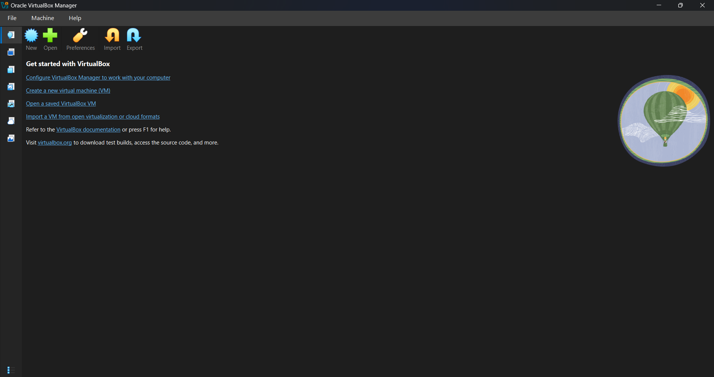

---

## Step 2. Create the NAT Network

Instead of using VirtualBox's basic "NAT" mode, I created a dedicated **NAT Network**. This matters because a plain NAT adapter is isolated per VM — the VM can reach the internet, but it can't talk to other VMs. A NAT Network is shared, so multiple VMs attached to it can talk to each other *and* reach the internet, which is exactly what a lab needs once more target machines get added.

Steps I followed:

1. Opened VirtualBox → **File → Tools → Network Manager**.
2. Went to the **NAT Networks** tab and clicked **Create**.
3. Renamed it to `NatNetwork` and set:

```text
Network Name: NatNetwork
IPv4 Prefix:  10.0.0.0/24
DHCP:         Enabled
IPv6:         Disabled
```

4. Clicked **Apply**.

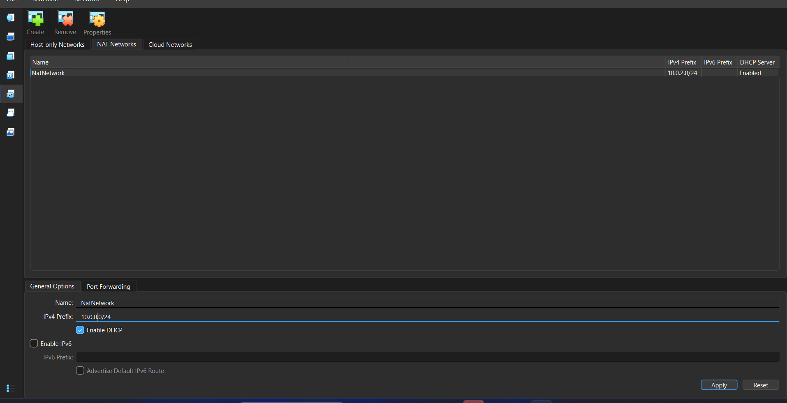

---

## Step 3. Import Kali Linux

Downloaded the official Kali Linux VirtualBox image from the Kali website and imported it into VirtualBox.

Then I set the network adapter on the VM like this:

```text
Adapter 1
Attached to:  NAT Network
Network:      NatNetwork
Adapter Type: Intel PRO/1000 MT Desktop
```

Allocated resources:

```text
RAM: 2048 MB
```

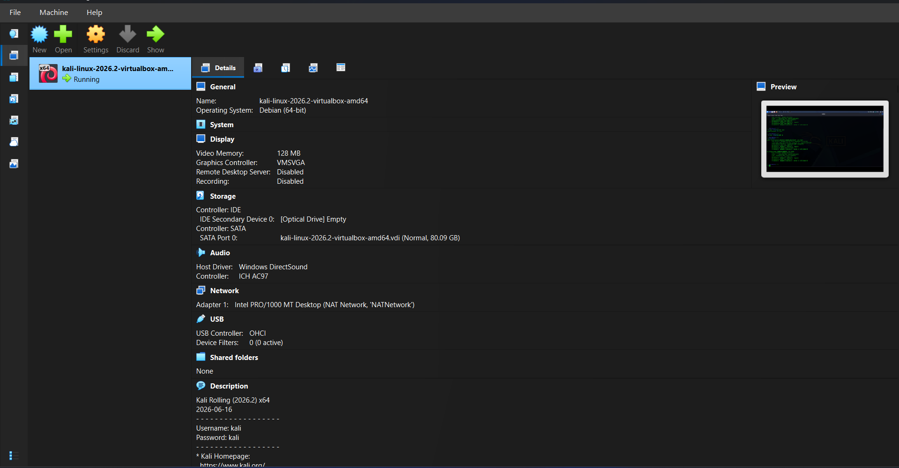
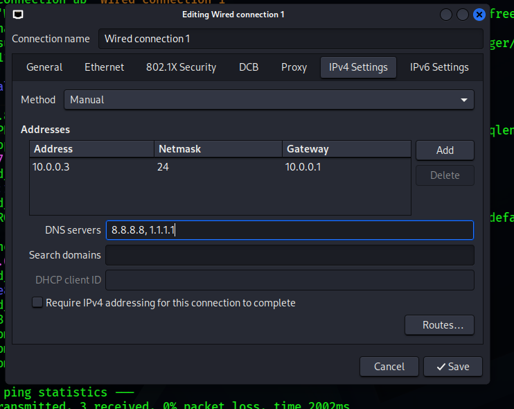

---

## Step 4. First Boot and DHCP Check

Booted the Kali VM and checked the network with:

```bash
ip a
```
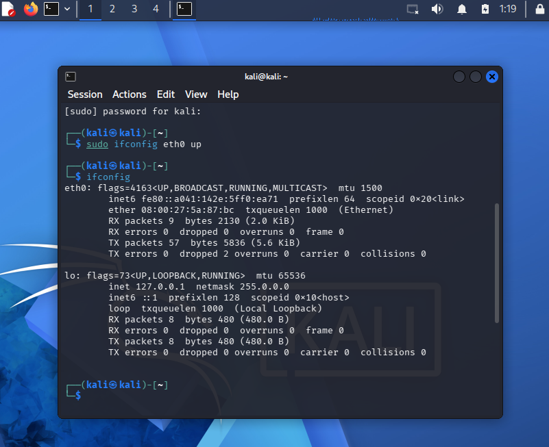

The interface came up, but `nmcli device status` kept showing `eth0` stuck in a **"connecting (getting IP configuration)"** state and it wouldn't finish getting an address. No matter how long I waited, it just sat there.

---

## Step 5. Diagnose the Issue

To see what was actually happening, I watched the NetworkManager logs live while trying to bring the interface up:

```bash
sudo journalctl -u NetworkManager -f
```
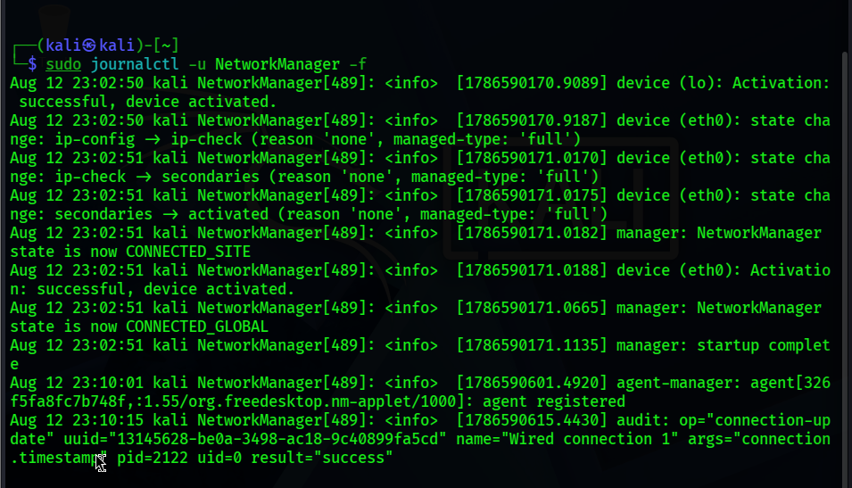


The interface would hang for a long time before eventually completing (or timing out) its DHCP request. After a bit of searching, I found this isn't specific to my setup at all — it's a **known networking issue on recent Kali Linux releases (2026.1 and newer)**. NetworkManager waits on IPv4 Duplicate Address Detection (DAD) before finishing the address configuration, and on virtualized/NAT networks that check can stall or time out, which makes it look like the VM has no internet connectivity even though the network itself is fine.

---

## Step 6. Fix It

The fix is a single `nmcli` command that disables the DAD timeout for the connection, so NetworkManager stops waiting on it and finishes bringing the interface up normally:

```bash
sudo nmcli connection modify "Wired connection 1" ipv4.dad-timeout 0
```
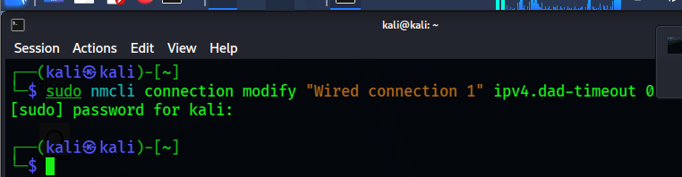

Then brought the connection back up to apply it:
In another terminal:
```bash
sudo nmcli device connect eth0

```

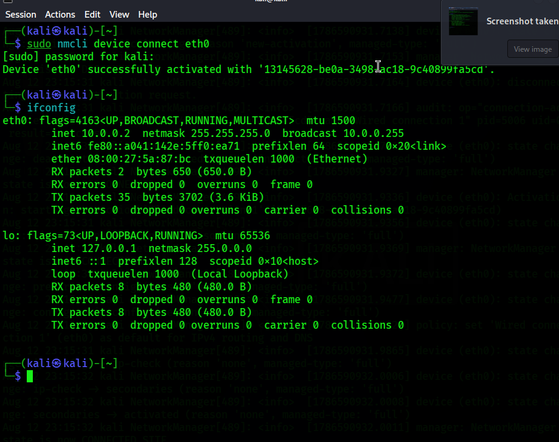
```bash
sudo nmcli connection down "Wired connection 1"
sudo nmcli connection up "Wired connection 1"
```

> **Note:** Connection names (like `"Wired connection 1"`) can differ between systems — always check with `nmcli connection show` first before running this.


---

## Step 7. Verify Everything Works

Ran through a basic set of checks to confirm the VM was fully online.

```bash
ip a
ping -c 3 10.0.0.1          # gateway
ping -c 3 google.com        # internet
nslookup networkwalks.com   # DNS resolution
```
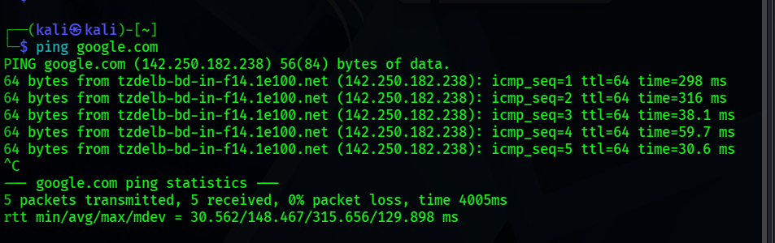
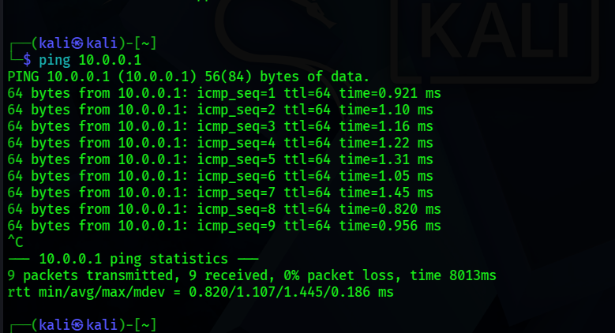

All checks came back clean — the VM picked up a proper DHCP address, the gateway was reachable, internet worked, and DNS resolved correctly.

---

## Step 8. Take a Clean Snapshot

Once the network was confirmed working, I took a VirtualBox snapshot as a safe restore point before doing anything else with the VM (installing tools, running scans, etc.).

Example snapshot name:

```text
Clean Kali - Network Setup
```

If anything breaks later, I can roll back to this exact working state instead of redoing the whole setup.
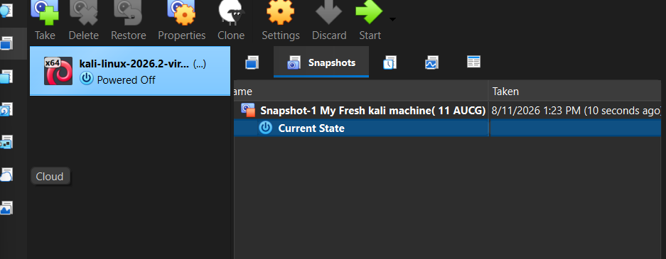

---

#  Lab Verification

|  Test                        | 🧾 Command                    | 🎯 Expected Result              |
| ----------------------------- | ------------------------------ | -------------------------------- |
|  Check IP address           | `ip a`                        | Address in the `10.0.0.0/24` range shown on eth0 |
|  Test gateway               | `ping 10.0.0.1`               | Successful replies               |
|  Test Internet connectivity | `ping 8.8.8.8`                | Successful replies               |
|  Test DNS resolution        | `nslookup networkwalks.com`   | Domain resolves                  |
|  Confirm NetworkManager status | `nmcli device status`      | `eth0` shows `connected`, not stuck |
| Verify snapshot            | Restore snapshot, run `ip a`  | Baseline configuration restored  |

### Example Results

```text
IP Address:
10.0.0.3/24

Gateway:
10.0.0.1

DNS:
8.8.8.8, 1.1.1.1
```

---

#  Problems Encountered & Solutions

## Problem 1. Kali Stuck on "Getting IP Configuration"

**Symptom:** `nmcli device status` showed `eth0` permanently stuck in `connecting (getting IP configuration)`, and the VM had no internet access.

**Cause:** This is a known issue on recent Kali Linux versions (2026.1+). NetworkManager waits for IPv4 Duplicate Address Detection to finish before completing the DHCP configuration, and on a virtualized NAT network that check can hang or take an unreasonably long time — even though there's no actual address conflict.

**Fix:** Disabled the DAD timeout for the connection:

```bash
sudo nmcli connection modify "Wired connection 1" ipv4.dad-timeout 0
sudo nmcli connection down "Wired connection 1"
sudo nmcli connection up "Wired connection 1"
```

After running this, the interface picked up a DHCP address normally within a few seconds.

> **Note:** Interface and connection names (like `"Wired connection 1"`) can differ between systems — always check with `nmcli connection show` first before running these commands.

---

## Problem 2. `VBoxManage` Not Recognized in Command Prompt

**Symptom:** Running `VBoxManage` from Windows `cmd` gave `'VBoxManage' is not recognized as an internal or external command`.

**Cause:** VirtualBox's install folder wasn't in the Windows PATH environment variable.

**Fix:** Either called it with the full path each time:

```cmd
"C:\Program Files\Oracle\VirtualBox\VBoxManage.exe" list dhcpservers
```

or added `C:\Program Files\Oracle\VirtualBox` to the system PATH permanently via **System Properties → Environment Variables**, then reopened Command Prompt.

---

## Problem 3. `dhclient` Command Not Found

**Symptom:** `sudo dhclient -v eth0` returned `sudo: dhclient: command not found`.

**Cause:** Modern Kali Linux no longer ships `isc-dhcp-client` by default — networking is fully handled by NetworkManager instead.

**Fix:** Used `nmcli` commands (`nmcli device connect eth0`, `nmcli connection up ...`) instead of `dhclient` for all DHCP operations.

---

#  What I Learned

### 1. NAT vs NAT Network

A plain NAT adapter isolates a VM to itself — it can reach the internet but not other VMs. A NAT Network is shared infrastructure that multiple VMs can join, so they can talk to each other while still reaching the internet. That's the right choice for any lab that will eventually have more than one VM.

### 2. Not Every Networking Problem Is a Config Mistake

I initially assumed the stuck DHCP request meant I'd misconfigured something. It turned out to be a known NetworkManager/DAD-related delay that's been reported across recent Kali releases, fixed with a single `dad-timeout` setting. It was a good reminder to check whether an issue is already documented before spending hours re-configuring things from scratch.

### 3. Reading Logs Instead of Guessing

`journalctl -u NetworkManager -f` was the most useful troubleshooting step in this whole project — watching the interface actually stall in real time made it obvious this was a timing/DAD issue rather than a misconfigured network.

### 4. Snapshots Are Cheap Insurance

Taking a clean snapshot right after getting the network working means I never have to redo this whole process again if a future exercise breaks something.

### 5. Documentation Matters

Writing down every command, every error message, and every fix — not just the final working state — makes this whole setup repeatable and much easier to debug next time something looks similar.

---

#  Security & Ethical Use

This lab is intended strictly for educational purposes and testing against systems I own or am explicitly authorized to test.

---

# 🔗 Tools & Resources

- **7-Zip:** https://7-zip.org/download.html
- **VirtualBox:** [https://virtualbox.org/wiki/Downloads](https://virtualbox.org/wiki/Downloads)
- **Kali Linux:** [https://kali.org/get-kali](https://kali.org/get-kali)

---
## Author
Rosan Shrestha
Cyber security intern at Networkwalk
**LinkedIn**: www.linkedin.com/in/rosanshrestha

##  Project Information

**Project:** Cybersecurity & Pentesting Lab Setup
